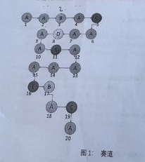

### 《大富翁》编程考试试题

有三名选手甲乙丙参加大富翁比赛，赛道上从起点到终点**20 个节点**，20 个节点存在 5 种类型 A、B、C、D、E。甲乙丙依次从起点开始，投掷骰子，产生随机数字 n（范围是 1 - 6），代表每一次可以走 n 步，赛道节点排列如图 1 所示。

5 种类型的节点的规则如下：

- A：正常前进 n 步
- B：后退一步
- C：投掷骰子无效一次，在 C 节点需要投掷骰子两次，第一次无效，按照第二次的投掷结果行走对应的步数。（例如在第 2 轮，选手甲前进至节点 5，则在第 3 轮，选手甲可以投掷骰子，但不能跳前进，到第 4 轮，选手甲投掷骰子，然后根据结果行走）
- D：回退到出发节点 1
- E：回退到上一个 E 节点。如果是第一个 E 节点，则按照节点 A 处理。

### 行进规则:

1. 甲乙丙 3 名选手，在每一次比赛开始的第 1 轮投掷时，先随机选出投掷顺序，在后续 n 轮，投掷顺序保持不变。比如甲先投，然后乙，然后丙。或者是乙、甲、丙。
2. 每一个选手在每次投掷前，可以决定投掷骰子的最大数值范围（1 到 6），例如选择 6，则产生的投掷结果范围是 1 - 6，如果选择 3，则产生的投掷结果范围是 1 - 3，如果选择 1，则产生的投掷结果是 1。
3. 如果投掷结果产生后，根据投掷结果最终行进至节点 X（X 不是起点，也不是终点，节点 X 是指最终行进到的节点，中间节点不考虑。例如选手甲，从起点投掷骰子结果 2，行进到节点 3，然后回退到节点 2，节点 X 指节点 2。），**节点 X 存在其他选手，则将其他选手踢回至起点**
4. 过滤：竞速中存在连续运用规则的情况，例如选手甲在节点 14，投掷骰子结果是 3，前进至节点 17（类型 B），然后的行走是先回退到节点 16（类型 E），然后回退到节点 11

甲乙丙三名选手，轮流投掷骰子，根据投掷骰子的结果行走，从 1 号节点出发，到 20 号节点结束。最早到达 20 号节点的选手获胜。如果 2 个选手同时到达 20 号节点，且第 3 个选手晚到达 20 号节点，则获胜选手为早到达 20 号节点的两个选手。如果 3 个选手同时到达，则为平局。

### 编程要求:

1. 使用面向对象的方法进行编程，可以根据自己偏好自由选择编程语言。
2. 本次题目中，赛道节点数量，赛道节点排列，节点类型数量，每种类型的规则变更，选手的数量变化是按照上述描述给定的。
3. 代码实现要考虑到扩展性，要在赛道节点数量、赛道节点排列、节点类型数量、每种类型的规则变更，选手的数量发生变化时，代码能够很容易地扩展和支持
4. 甲乙丙选手可以选择相同的投掷策略，尽量避免被其他选手踢回至起点，并且尽量能够把其他选手踢回至起点。在相同投掷策略，经历过多次比赛后，获胜概率应该相近。
5. 构造赛道，并按顺序输出赛道
6. 输出结果：
   - 输出每一名选手每次投掷骰子的结果，行走记录
   - 输出投掷次数和获胜选手

### 示例参考如下:

甲：投掷次数 6
乙：投掷次数 9
丙：投掷次数 7

投掷和行走结果：
0：甲在节点 1，乙在节点 1，丙在节点 1，投掷顺序（甲，乙，丙）
第 1 轮：
甲：投掷选择 6，结果 3，前进至节点 4
乙：投掷选择 3，结果 2，前进至节点 3，回退至节点 2
丙：投掷选择 6，结果 6，前进至节点 6
第 2 轮：
甲：投掷选择 2，结果 1，前进至节点 5
乙：投掷选择 6，结果 5，前进至节点 7
丙：投掷选择 6，结果 4，前进至节点 10
第 3 轮：
甲：投掷选择 2，结果 2，前进至节点 7，将乙踢回至节点 1
乙：投掷选择 6，结果 1，前进至节点 5
丙：投掷选择 6，结果 1，前进至节点 11
第 4 轮：
甲：投掷选择 4，结果 3，前进至节点 10
乙：投掷选择 6，结果 5，投掷无效一次
丙：投掷选择 6，结果 3，前进至节点 14
第 5 轮：
甲：投掷选择 4，结果 4，前进至节点 14，将丙踢回至节点 1
乙：投掷选择 6，结果 4，前进至节点 10
丙：投掷选择 6，结果 6，前进至节点 6
第 6 轮：
甲：投掷选择 6，结果 6，前进至节点 20，到达终点
乙：投掷选择 6，结果 5，前进至节点 15
丙：投掷选择 6，结果 4，前进至节点 4
第 7 轮：
甲：已经到达终点
乙：投掷选择 6，结果 4，前进至节点 19
丙：投掷选择 6，结果 5，前进至节点 9
第 8 轮：
甲：已经到达终点
乙：投掷选择 6，结果 4，投掷无效一次
丙：投掷选择 6，结果 6，前进至节点 12
第 9 轮：
甲：已经到达终点
乙：投掷选择 6，结果 3，前进至节点 20，到达终点
丙：投掷选择 6，结果 3，前进至节点 15
第 10 轮：
甲：已经到达终点
乙：已经到达终点
丙：投掷选择 6，结果 3，前进至节点 18
第 11 轮：
甲：已经到达终点
乙：已经到达终点
丙：投掷选择 6，结果 4，前进至节点 20，到达终点

获胜选手：甲

### 其他要求:

1. 提交物包括：完整项目源程序和已经编译好的可执行程序，并分别按照 src, bin 三个目录分别存放好，打包提交。如果是 js 或者 python 实现，则只需要按照 src 目录存放好打包提交。
2. 可以网上查询相关技术资料，但要确保独立完成，不得互相抄袭代码。

### 评分要点及检查项:

1. 合理正确的使用面向对象的方法进行程序结构设计。
2. 类设计合理，数据结构运用合理，扩展性良好。
3. 编码规范，函数及类命名合理准确、无歧义。
4. 程序的关键实现部分要进行逻辑注释说明。
5. 程序源码可以编译通过，无错误及警告提示，无内存等资源泄露。
6. 请同学做好系统分析，准确理解题意，正确模拟运行结果。